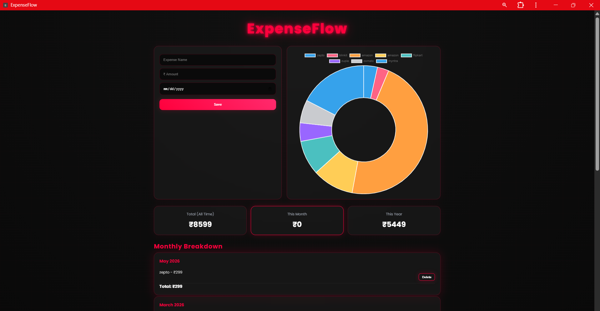

# 💰 ExpenseFlow - Progressive Web App (PWA)

ExpenseFlow is a full-stack expense tracking Progressive Web App (PWA) built using HTML, CSS, JavaScript, Java Servlets, JDBC, Apache Tomcat, and MySQL.

It allows users to record expenses, visualize spending through interactive charts, and view monthly and yearly summaries while supporting offline functionality.

## ✨ Features

- 📊 Interactive expense visualization using Chart.js
- 💸 Add and delete expenses
- 📅 Monthly and yearly expense summaries
- 📱 Installable Progressive Web App (PWA)
- 🌐 Offline support with Service Worker
- 📱 Responsive UI
- 💾 MySQL database integration using JDBC


## 🛠️ Tech Stack

### Frontend
- HTML5
- CSS3
- JavaScript

### Backend
- Java Servlets
- JDBC
- Apache Tomcat

### Database
- MySQL

### Other
- Chart.js
- Service Worker
- Web App Manifest


## 🚀 Installation

1. Clone the repository

```bash
git clone https://github.com/Karan-21-2004/ExpenseFlow-PWA.git
```

2. Import into VS Code.

3. Configure Apache Tomcat.

4. Import `database/expenseflow.sql` into MySQL.

5. Update the JDBC username and password.

6. Run on Tomcat.

## 📸 Application Preview



## 👨‍💻 Author

**Karan**

GitHub:
https://github.com/Karan-21-2004
